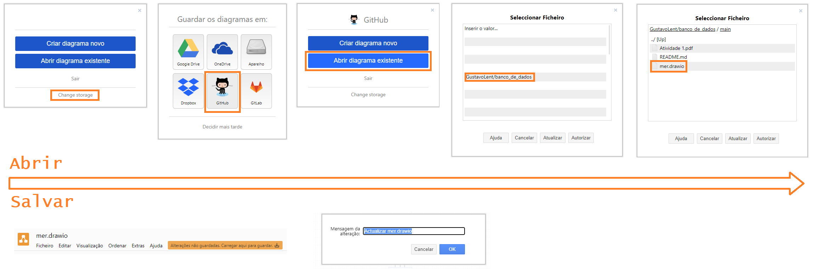

# Banco de Dados
Matéria do curso de Ciências da Computação - Unesp Rio Claro

[Texto-base da atividade](./Atividade%201.pdf)

[Análise do texto da atividade](https://docs.google.com/document/d/1hd7sGNWcESnR27U_HU_x-inEUr5Pcc_PcGOSXE99TwA/edit?usp=sharing)

[Modelo Entidade-Relacionamento](./mer.drawio)

## Instruções para abrir o diagrama no [Draw.IO](https://app.diagrams.net/)
